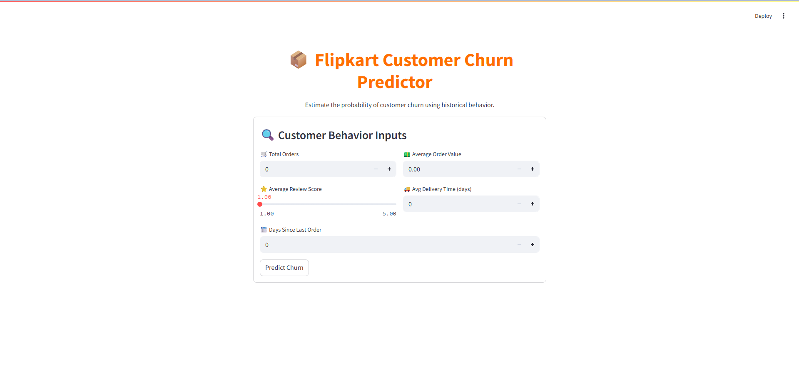
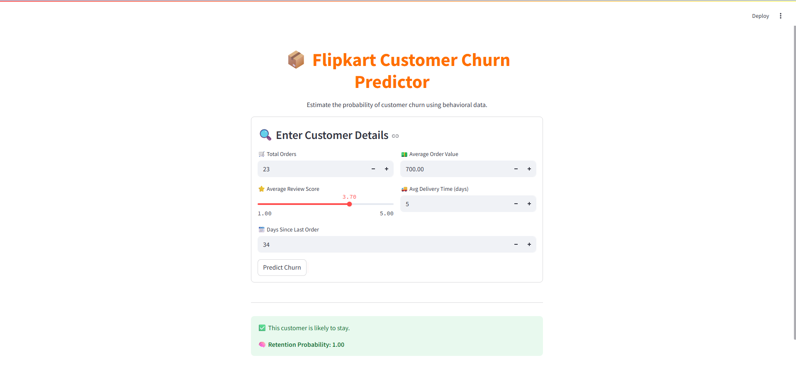

# 📦 Flipkart Customer Churn Prediction


This project is an end-to-end implementation of a customer churn prediction system for an e-commerce platform, **inspired by Flipkart**, using a real-world dataset from [Olist](https://www.kaggle.com/datasets/olistbr/brazilian-ecommerce).

It includes:
- Data preprocessing and feature engineering
- Churn label creation
- Model training with Random Forest
- A visually rich Streamlit app for prediction
- Ready-to-deploy files and UI customization using CSS

---

## 🧠 Objective

To predict whether a customer is likely to churn based on their order behavior, delivery patterns, spending, and review activity.

---

## 📁 Dataset

We use the [Olist Brazilian E-Commerce Dataset](https://www.kaggle.com/datasets/olistbr/brazilian-ecommerce), which simulates realistic customer behavior on an e-commerce platform. The dataset includes:

| File Name | Description |
|-----------|-------------|
| `olist_orders_dataset.csv` | Orders with timestamps and status |
| `olist_customers_dataset.csv` | Customer IDs and location info |
| `olist_order_reviews_dataset.csv` | Review scores per order |
| `olist_order_payments_dataset.csv` | Payment method and amount |
| `olist_order_items_dataset.csv` | Items and delivery info per order |
| `olist_products_dataset.csv` | Product categories |
| `olist_sellers_dataset.csv` | Seller details |
| `olist_geolocation_dataset.csv` | Customer/seller location (lat/lon) |

---

## 🧾 Dataset Schema (Placeholders)


## 🔍 Churn Definition

**Churned**: Customers who have not placed an order in the last 90 days.

We label churn using the `order_purchase_timestamp` and calculate days since the last order.

---

## 🛠 Feature Engineering

| Feature | Description |
|--------|-------------|
| `total_orders` | Total orders by the customer |
| `avg_review_score` | Mean review rating |
| `avg_order_value` | Avg. payment amount per order |
| `avg_delivery_time` | Avg. delivery duration |
| `days_since_last_order` | Days since the customer last ordered |

---

## 🤖 Model Training

- Algorithm: **Random Forest Classifier**
- Train/test split: 70/30
- Evaluation: Accuracy, Confusion Matrix, Classification Report
- Exported model with `joblib` to use in the app

---

## 💻 Streamlit App (Interactive UI)

### ✨ Features:
- 5 input fields
- CSS-enhanced layout with icons and columns
- Real-time churn prediction with probability
- Easy to extend and deploy

### 📷 UI Snapshots (Placeholders)

#### 🖼️ Home Page




#### 🖼️ Prediction Result




## 🧾 How to Run the App

### 🛠 1. Train the model
```bash
python model_training.py
```

### 🚀 2. Launch the app
```bash
streamlit run flipkart_churn_ui_enhanced.py
```

### 📦 3. Web Interface

Visit: `http://localhost:8501`

---

## 🧑‍💻 Folder Structure

```
Flipkart_customer_Churn_Analysis/

├── Notebooks
    └── data_processing.ipynb
    └── feature_engineering.ipynb
├── images
├── flipkart_churn_model.pkl
├── flipkart_churn_Stramlit.py
├── model_training.py
├── README.md

```

---

## 📝 Future Enhancements

- Add more behavioral and product features
- Deploy on Streamlit Cloud or HuggingFace Spaces
- Batch prediction via CSV upload
- SHAP explanations for model interpretability

---

## 🙌 Credits

- Dataset: [Olist @ Kaggle](https://www.kaggle.com/datasets/olistbr/brazilian-ecommerce)

- Built by: Divyanshu Kumar
