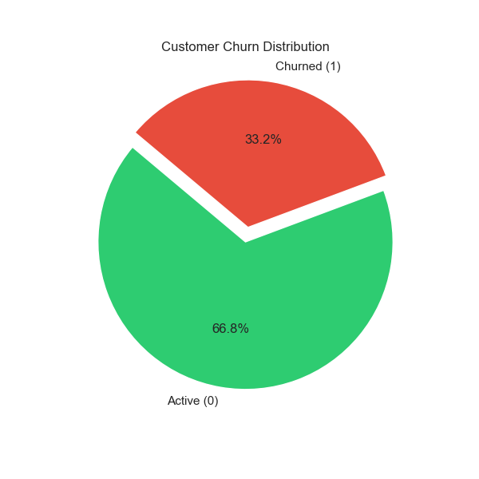
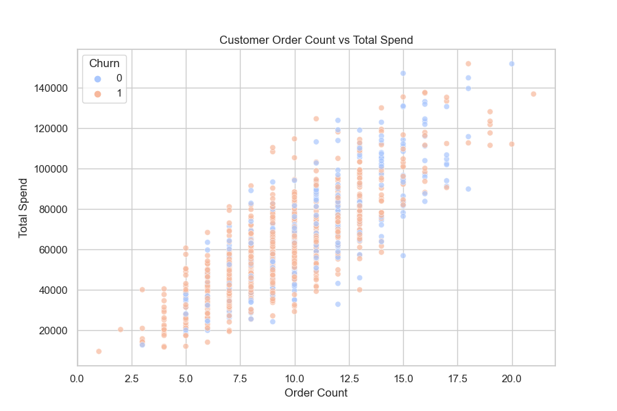
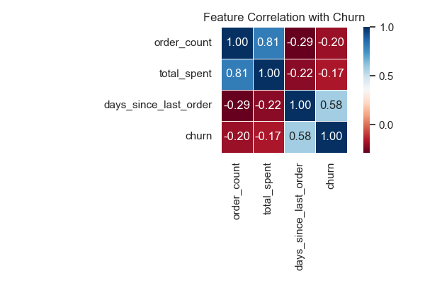

<!DOCTYPE html>
<html lang="en">
<head>
    <meta charset="UTF-8">
    
</head>
<body>

<h1 align="center">🛒 Flipkart-style Customer Churn Prediction</h1>

<h2>🔍 About the Project</h2>

This project simulates a realistic customer churn prediction workflow for an e-commerce company like <strong>Flipkart</strong> or <strong>Amazon</strong>. We use <code>Faker</code> to generate realistic synthetic data, then analyze customer behavior to predict churn.

<h3>💼 Use Case</h3>
<ul>
    <li>🧠 <strong>Goal:</strong> Identify customers likely to churn based on their purchase patterns</li>
    <li>📈 <strong>Impact:</strong> Enables targeted retention strategies and better customer lifetime value prediction</li>
</ul>

<h2>📊 Features</h2>
<ul>
    <li>🧪 Data Simulation with Faker (300 customers, 50 products, 1000 transactions)</li>
    <li>📁 3 datasets: <code>customers.csv</code>, <code>products.csv</code>, <code>sales_data.csv</code></li>
    <li>🧠 Churn labeling using "no purchase in last 30 days"</li>
    <li>🔍 EDA + insightful visualizations with Seaborn & Matplotlib</li>
    <li>🤖 Ready for model training with features like <code>order_count</code>, <code>total_spent</code>, etc.</li>
</ul>

<h2>📂 Project Structure</h2>
<pre><code>flipkart_churn_prediction/
│
├── generate_dataset.py       # 📄 Generates realistic data using Faker
├── churn_prediction.py       # 🤖 Computes churn labels and builds model
├── visualize_churn.py        # 📊 Builds all churn-related plots
│
├── customers.csv             # 👥 Simulated customer data
├── products.csv              # 📦 Product catalog
├── sales_data.csv            # 🛒 Transactions log
│
└── README.html               # 📘 This file!
</code></pre>

<h2>🚀 How to Run the Project</h2>

<h3>🛠 Requirements</h3>
<pre><code>pip install pandas faker matplotlib seaborn</code></pre>

<h3>▶️ Steps</h3>
<pre><code>python generate_dataset.py
python churn_prediction.py
python visualize_churn.py
</code></pre>

<h2>📸 Sample Visualizations</h2>

    
    
📊 Pie chart showing churn vs active customers

    
    
🎯 Scatter plot of order count vs total spend by churn

    
    
🔥 Heatmap showing feature correlation with churn

<h2>📌 Next Steps</h2>
<ul>
    <li>✅ Add ML models (Random Forest, Logistic Regression)</li>
    <li>✅ Build a dashboard (Power BI / Streamlit)</li>
    <li>🔄 Automate retraining on new data</li>
</ul>

<h2>🤝 Let's Connect</h2>

Built with ❤️ by <strong>Your Name</strong> 
🌐 <a href="https://www.linkedin.com/in/divyanshu0519/" target="_blank">LinkedIn</a> |
💼 <a href="https://my-portfolio-page-sage.vercel.app/" target="_blank">Portfolio</a>

</body>
</html>
