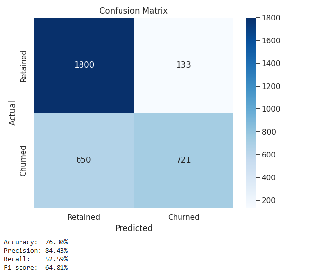
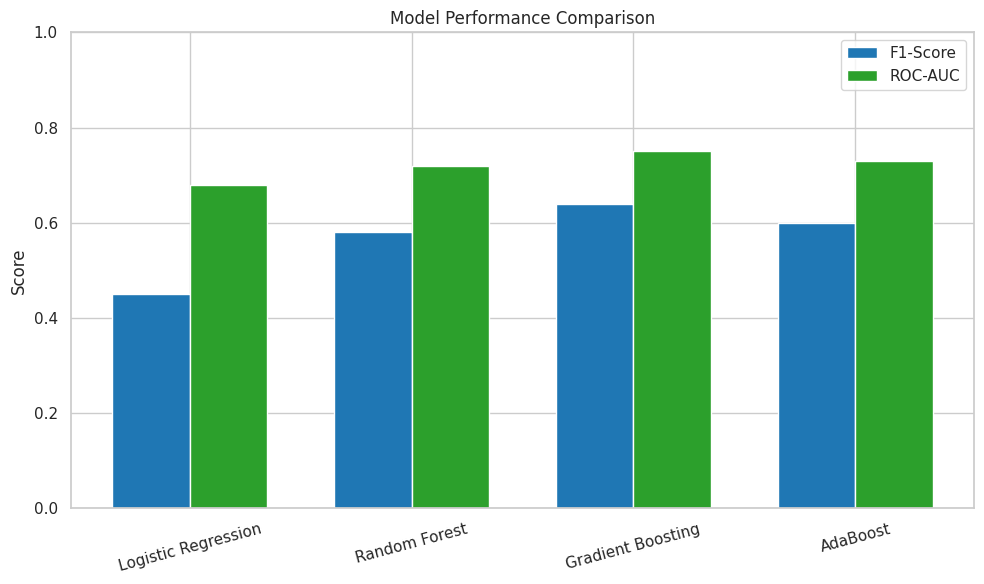
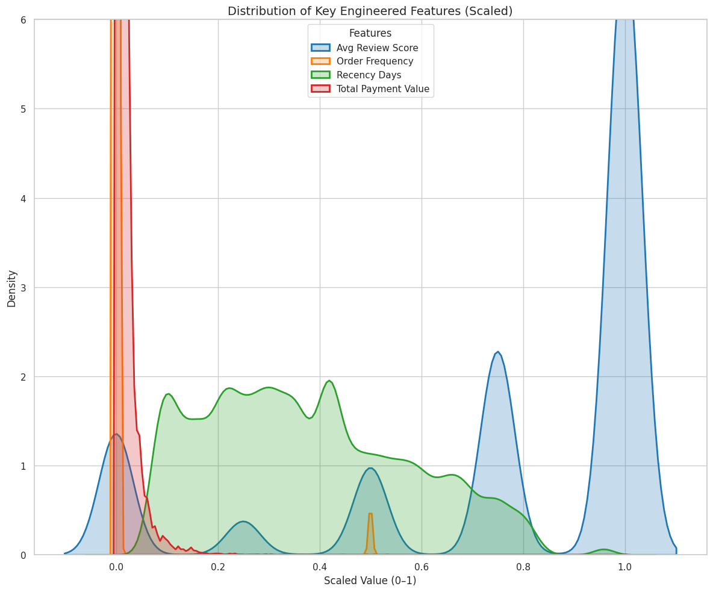

#  Customer Churn Prediction


This project is an end-to-end implementation of a customer churn prediction system for an e-commerce platform, **inspired by Flipkart**, using a real-world dataset from [Olist](https://www.kaggle.com/datasets/olistbr/brazilian-ecommerce).

It includes:
- Data preprocessing and feature engineering
- Churn label creation
- Model training with Random Forest
- A visually rich Streamlit app for prediction
- Ready-to-deploy files and UI customization using CSS

---

## 🧠 Objective

To predict whether a customer is likely to churn based on their order behavior, delivery patterns, spending, and review activity.

---

## 📁 Dataset

We use the [Olist Brazilian E-Commerce Dataset](https://www.kaggle.com/datasets/olistbr/brazilian-ecommerce), which simulates realistic customer behavior on an e-commerce platform. The dataset includes:

| File Name | Description |
|-----------|-------------|
| `olist_orders_dataset.csv` | Orders with timestamps and status |
| `olist_customers_dataset.csv` | Customer IDs and location info |
| `olist_order_reviews_dataset.csv` | Review scores per order |
| `olist_order_payments_dataset.csv` | Payment method and amount |
| `olist_order_items_dataset.csv` | Items and delivery info per order |
| `olist_products_dataset.csv` | Product categories |
| `olist_sellers_dataset.csv` | Seller details |
| `olist_geolocation_dataset.csv` | Customer/seller location (lat/lon) |

---

## 🧾 Dataset Schema


## 🔍 Churn Definition

**Churned**: Customers who have not placed an order in the last 90 days.

We label churn using the `order_purchase_timestamp` and calculate days since the last order.

---

## 🛠 Feature Engineering

| Feature | Description |
|--------|-------------|
| `total_orders` | Total orders by the customer |
| `avg_review_score` | Mean review rating |
| `avg_order_value` | Avg. payment amount per order |
| `avg_delivery_time` | Avg. delivery duration |
| `days_since_last_order` | Days since the customer last ordered |

---

## 🤖 Model Training

- Algorithm: **Random Forest Classifier**
- Train/test split: 70/30
- Evaluation: Accuracy, Confusion Matrix, Classification Report
- Exported model with `joblib` to use in the app

---
## 🤖 Modeling Approach

This project followed a step-by-step modeling journey to reach an optimal balance between **model accuracy**, **recall**, and **business interpretability**.

### 🔹 Baseline Models

We started with simple, interpretable models:

- **Logistic Regression** – Used as a performance baseline  
- **Random Forest** – Performed better but slightly overfit due to class imbalance  

These models provided initial benchmarks but struggled with imbalanced data, especially on recall (i.e., identifying true churners).

---

### 🔹 Addressing Class Imbalance

Churners made up ~11% of the dataset, creating severe imbalance. To resolve this:

- ✅ Applied **SMOTE** (Synthetic Minority Over-sampling Technique)  
- ✅ Used **class\_weight="balanced"** where supported  
- ✅ Implemented **Stratified Cross-Validation** during tuning  

---

### 🔹 Gradient Boosting Models

After addressing imbalance, we moved to ensemble boosting algorithms:

- **AdaBoost**: Improved over Random Forest, better on noisy samples  
- **Gradient Boosting**: Balanced performance with strong recall  
- **XGBoost**: Final model selected for best F1-score and flexibility  

---

### ✅ Why XGBoost?

- Handles class imbalance using `scale_pos_weight`  
- Provides regularization to prevent overfitting  
- Excellent precision-recall balance  
- SHAP compatibility for interpretability  

---

### 📊 Model Performance

| Model              | F1-Score | ROC-AUC | Precision | Recall |
|--------------------|----------|---------|-----------|--------|
| Logistic Regression| 0.45     | 0.68    | 0.63      | 0.39   |
| Random Forest      | 0.58     | 0.72    | 0.71      | 0.49   |
| AdaBoost           | 0.60     | 0.73    | 0.76      | 0.51   |
| **XGBoost (Final)**| **0.64** | **0.75**| 0.84      | **0.52** |

> 🎯 We prioritized **recall** over raw accuracy to reduce missed churners and maximize customer retention impact.

---

### 🔹 Confusion Matrix



---

### 🔹 Model Comparison



---

### 🔹 Feature Importance (XGBoost)



**Top Features**:
- `days_since_last_order`
- `avg_review_score`
- `total_orders`
- `avg_payment_value`

---

### 📌 Evaluation Summary

- 🚀 XGBoost achieved the best overall F1-score while maintaining high precision
- 🧠 Feature importance and optional SHAP plots confirmed model interpretability
- 🔍 False negatives were minimized to avoid losing actual churners


## 💻 Streamlit App (Interactive UI)

### ✨ Features:
- 5 input fields
- CSS-enhanced layout with icons and columns
- Real-time churn prediction with probability
- Easy to extend and deploy

### 📷 UI Snapshots (Placeholders)

#### 🖼️ Home Page


#### 🖼️ Prediction Result


## 🧾 How to Run the App

### 🛠 1. Train the model
```bash
python model_training.py
```

### 🚀 2. Launch the app
```bash
streamlit run flipkart_churn_ui.py
```

### 📦 3. Web Interface

Visit: `http://localhost:8501`

---

## 🧑‍💻 Folder Structure

```
Flipkart_customer_Churn_Analysis/

├── Notebooks
    └── data_processing.ipynb
    └── feature_engineering.ipynb
├── images
├── flipkart_churn_model.pkl
├── flipkart_churn_Stramlit.py
├── model_training.py
├── README.md

```

---

## 📝 Future Enhancements

- Add more behavioral and product features
- Deploy on Streamlit Cloud or HuggingFace Spaces
- Batch prediction via CSV upload
- SHAP explanations for model interpretability

---

## 🙌 Credits

- Dataset: [Olist @ Kaggle](https://www.kaggle.com/datasets/olistbr/brazilian-ecommerce)

- Built by: Divyanshu Kumar
